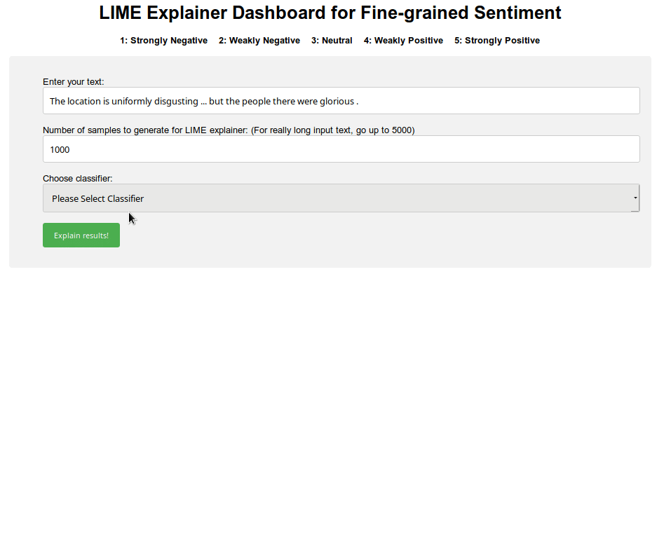

# Fine Grained Sentiment Classification
This repo shows a comparison and discussion of various NLP methods to perform 5-class sentiment classification on the  [Stanford Sentiment Treebank](https://nlp.stanford.edu/sentiment/) (SST-5) dataset. The goal is to predict classes on this dataset with multiple rule-based, linear and neural network-based classifiers and see how they differ from one another.

Currently the following classifiers have been implemented:
 - **TextBlob**: Rule-based, uses the internal `polarity` metric from the [TextBlob](https://textblob.readthedocs.io/en/dev/) library.
 - **Vader**: Rule-based, uses the `compound` polarity scores from the [VADER](https://www.nltk.org/_modules/nltk/sentiment/vader.html) library.
 - **Logistic Regression**: Trains a simple logistic regression model in scikit-learn after converting the vocabulary to feature vectors and considering the effect of word frequencies using TF-IDF.
 - **SVM**: Trains a simple linear  support vector machine in scikit-learn after converting the vocabulary to feature vectors and considering the effect of word frequencies using TF-IDF.
 - **FastText**: Trains a [FastText](https://fasttext.cc/docs/en/supervised-tutorial.html) classifier using a combination of trigrams and a 3-word context window size.
 - **Flair**: Trains a [Flair NLP](https://github.com/zalandoresearch/flair) classifier using ["stacked" embeddings](https://github.com/zalandoresearch/flair/blob/master/resources/docs/TUTORIAL_7_TRAINING_A_MODEL.md#training-a-text-classification-model), i.e. a combined representation of either GloVe, Bert or ELMo word embeddings and Flair (forward and backward) string embeddings.
 - **Causal Transformer**: Trains a small transformer model based on OpenAI's GPT-2 architecture (but *much* smaller) using a causal (i.e. *left-to-right*) pre-trained language model trained on Wikitext-103 data. The pre-trained weights are obtained from HuggingFace's [NAACL transfer learning tutorial](https://github.com/huggingface/naacl_transfer_learning_tutorial). Once we download the pre-trained language model, we add a custom classification head to the base transformer as shown in `training/transformer_utils/model.py`, and then fine-tune it on the SST-5 dataset.

## Installation

First, set up virtual environment and install from ```requirements.txt```:

    python3 -m venv venv
    source venv/bin/activate
    pip3 install -r requirements.txt

For further development, simply activate the existing virtual environment.

    source venv/bin/activate


## Training the Classifiers

The training of the linear models (Logistic Regression and SVM) are done during runtime of the classifier (next step) since they run very fast on this small dataset. To train the methods that rely on word/string embeddings, however, we use separate scripts to help more easily tune the hyperparameters. 

Training code for the models is provided in the `training` directory. 

#### FastText
To train the FastText model, it is strongly recommended to use automatic hyperparameter  optimization [as per the documentation](https://fasttext.cc/docs/en/autotune.html).

First, build the fastText command line interface from source (Unix only):

    $ git clone https://github.com/facebookresearch/fastText.git
    $ cd fastText
    $ make

Then, perform automatic tuning using the below command to find the optimum hyperparameters, by specifying paths to the training and dev set. [Quantization](https://fasttext.cc/docs/en/autotune.html#constrain-model-size) (to reduce model size) is also tuned in this process - in this case we set a maximum model size of 10 MB. Verbosity is enabled to see what hyperparameters gave the best F1-score.

    ./fasttext supervised -input ../data/sst/sst_train.txt -output ../model_hyperopt \
    -autotune-validation ../data/sst/sst_dev.txt -autotune-modelsize 10M -verbose 3

This outputs the trained model (`.ftz` extension) that gives the best F1-score on our dataset. 

The Python file `training/train_fasttext.py` can also be used for training the FastText model from within Python (without having to build the CLI from source) - however, the Python API does not have auto-tune capability so the hyperparameters have to be tuned manually (not recommended).

#### Flair
To train the Flair model, run `train_flair.py`. To enhance the model's context, we can stack word embeddings (either GloVe, ELMo or Bert) with Flair's string embeddings. This model takes significantly longer to run on a GPU-enabled machine (of the order of several hours).

The below examples show how to train Flair models with stacked word/string embeddings using the provided script. Specifying the `--stack` argument will invoke either GloVe, ELMo (original) or Bert (Base, cased) word embeddings along with Flair forward/backward string embeddings to train the classifier. 

    cd training
    python3 train_flair.py --stack glove --epochs 25
    python3 train_flair.py --stack bert --epochs 25
    python3 train_flair.py --stack elmo --epochs 25

To resume training from a checkpoint, just pass in the path to the checkpoint file.

    cd training
    python3 train_flair.py --stack elmo --checkpoint models/flair/elmo/checkpoint.pt --epochs 25

Training this model to 50-100 epochs can take more than a day on a single GPU.

#### Causal Transformer
The causal transformer in this repo is implemented as per [HuggingFace's transfer learning tutorial example](https://github.com/prrao87/naacl_transfer_learning_tutorial). An optional argument to include *adapter modules* as per the paper ["Parameter-efficient Transfer Learning for NLP"](https://arxiv.org/pdf/1902.00751.pdf) is provided in the script `train_transformer.py`. A full description of the pre-training stage and the logic for implementing the transformer layers is provided in the [tutorial slides](https://docs.google.com/presentation/d/1fIhGikFPnb7G5kr58OvYC3GN4io7MznnM0aAgadvJfc/edit). 

Train the causal transformer (fine-tuning for classification only) as shown below. This version of the transformer has 50 million trainable parameters. 

    cd training
    python3 train_transformer.py --n_epochs 3 --lr 6.5e-5 --gradient_acc_steps 2

To run the model with adapters, i.e. bottleneck layers (inserted within skip-connections just after the attention and feed-forward modules), use the `adapters_dim` argument. This will **only** train the adapters, linear layers and the added embeddings, while keeping the other parameters **frozen**. 

In the below example, we include adapters with a dimensionality of 32 - adding this argument will reduce the number of trainable parameters in the model to 25% of the original (around 12 million). Note that we **scale up the learning rate by a factor of 10** when using adapters because we added a number of newly initialized parameters to the pre-trained model. Gradients are accumulated over two steps to simulate larger batch sizes, which helps bring down the losses faster. 

    python3 train_transformer.py --adapters_dim 32 --n_epochs 3 --lr 6.5e-4 --gradient_acc_steps 2

The transformer model needs only 3-4 epochs of training (beyond which it begins overfitting to this dataset) - which can take anywhere from minutes to a few hours on a single GPU with a batch size of 32. 

## Run sentiment analysis and output confusion matrix
 
Once the classifiers have been trained on the SST-5 data, run the file ```predictor.py``` to perform 5-class sentiment classification on the test set. This file accepts arguments for multiple classifier models at a time (just space-separate the model names, all in lower case). The requested classification models are run and evaluated on the test set and confusion matrix plots are output (for each model) in the `./Plots/` directory.

The method class and classifier model specification can be done using the dictionary within the file `predictor.py`. The rule-based and linear models do not have trained models associated with them, hence they are left as `None`. For any other learning-based models, the trained model file can be specified in this dictionary to avoid having to pass it as an argument. 

    METHODS = {
        'textblob': {
            'class': "TextBlobSentiment",
            'model': None
        },
        'vader': {
            'class': "VaderSentiment",
            'model': None
        },
        'logistic': {
            'class': "LogisticRegressionSentiment",
            'model': None
        },
        'svm': {
            'class': "SVMSentiment",
            'model': None
        },
        'fasttext': {
            'class': "FastTextSentiment",
            'model': "models/fasttext/sst-5.ftz"
        },
        'flair': {
            'class': "FlairSentiment",
            'model': "models/flair/best-model-elmo.pt"
        },
        'transformer': {
            'class': "TransformerSentiment",
            'model': "models/transformer",
        }
    }

The above dictionary makes it easier to update the framework with more models and methods over time - simply update the method name and its class names and models files as shown above.

To run a single case just pass one method as an argument:
 
    python3 predictor.py --method textblob

All methods from the dictionary can be run sequentially using a single command as follows:

    python3 predictor.py --method textblob vader logistic svm fasttext flair

If at a later time, multiple versions of trained models need to be run sequentially, we can specify these using the `--model` argument - **this will override the model specified in the dictionary within the file**.

    python3 predictor.py --method fasttext --model models/fasttext/sst-bigram.bin
    python3 predictor.py --method fasttext --model models/fasttext/sst-trigram.bin

OR 

    python3 predictor.py --method flair --model models/flair/best-model-elmo.pt
    python3 predictor.py --method flair --model models/flair/best-model-bert.pt

To run the predictor for a new transformer model, simply specify the model path. The path specified must contain the PyTorch `config` metadata file (`.bin`) and the PyTorch model weights (`.pth`).

    python3 predictor.py --method transformer --model models/transformer

## Explain classifier results

Once a sentiment classifier has been trained, we can use it to explain the classifier's predictions. To do this we make use of the [LIME library](https://github.com/marcotcr/lime). The LIME method generates a local linear approximation of the model (regardless of whether the model is *globally* nonlinear or not), and then perturbs this local model to identify features that influence the classification results the most. For multi-class cases such as this one, LIME produces a list of probabilities for each class, and also highlights the effect of each token feature on the predicted class using a [one-vs-rest method](https://en.wikipedia.org/wiki/Multiclass_classification#One-vs.-rest).

To make it easier to update the explainer framework with more methods over time, look at the method dictionary in `explainer.py`.

    METHODS = {
        'textblob': {
            'class': "TextBlobExplainer",
            'file': None
        },
        'vader': {
            'class': "VaderExplainer",
            'file': None
        },
        'logistic': {
            'class': "LogisticExplainer",
            'file': "data/sst/sst_train.txt"
        },
        'svm': {
            'class': "SVMExplainer",
            'file': "data/sst/sst_train.txt"
        },
        'fasttext': {
            'class': "FastTextExplainer",
            'file': "models/fasttext/sst-5.ftz"
        },
        'flair': {
            'class': "FlairExplainer",
            'file': "models/flair/best-model-elmo.pt"
        },
        'transformer': {
            'class': "TransformerExplainer",
            'file': "models/transformer"
        }
    }
**Note**: 
- The rule-based approaches (TextBlob and Vader) do *not* output class probabilities (they simply output a float score of sentiment in the range `[-1, 1]`). To explain these results using LIME, we artificially generate class probabilities for each class using a combination of binning (to get an integer class in the range `[1-5]` depending the float value), and then "simulating" the class probabilities using a normal distribution with the mean equal to the predicted class. *This approach is hacky* and is by no means the "right" way to do this, but it allows us to compare the outputs of rule-based classifiers like TextBlob and VADER on an equal footing (using similar metrics) as the learning-based classifiers.
- For the logistic regression and SVM, specify the path to the *training data* (the logistic regression model is trained within the explainer class) while for the other learners, point to the trained classifier models directly. 
- For the transformer, specify just the *model path* (with the metadata and model file in that path).

The sentences whose classification results are to be explained are specified as a list in `explainer.py`. 

    samples = [
        "It's not horrible, just horribly mediocre.",
        "The cast is uniformly excellent... but the film itself is merely mildly charming.",
    ]

Run the explainer for the list of sentences using each, or all the classification methods as follows:

    python3 explainer.py --method textblob vader logistic svm fasttext
    python3 explainer.py --method flair
    python3 explainer.py --method transformer

This outputs HTML files with embeds showing the explanations for each sample sentence for each classifier used.

# Demo Front-end App
A simple Flask-based front-end application is developed that takes in a text sample and outputs LIME explanations for the different methods as shown below.
* The application is deployed using Heroku: https://sst5-explainer.herokuapp.com/
* The source code for the Flask-based app is in [this separate repository](https://github.com/prrao87/fine-grained-sentiment-app). 

[Play with your own text examples](https://sst5-explainer.herokuapp.com/) as shown below and see the fine-grained sentiment results explained!

**NOTE:** Because the PyTorch-based models (Flair and the causal transformer) are quite expensive to run inference with (they require a GPU), these methods are not deployed.



